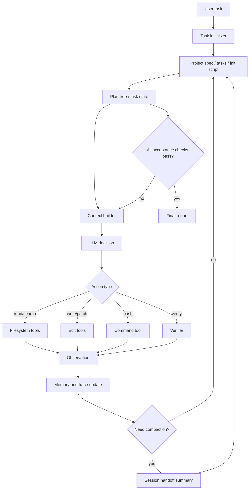

# Problem 3 Agent Framework Design

## 1. Goal

Build a minimal command-line coding agent that can run for long coding tasks without model training. The system focuses on the harness: task state, context handoff, verification, and filesystem-backed Skill/Memory.

The target is not to build the richest agent, but to make long-running behavior observable and measurable:

- keep explicit task progress instead of relying on chat history;
- survive context budget limits through compact handoff files;
- avoid premature completion through independent checks;
- persist reusable skills and task memory across sessions;
- produce run traces for experiments and ablations.

## 2. Core Idea

The framework is a state-machine around an LLM. The LLM proposes the next action, but the harness owns state transitions, context budget, tool execution, verification, and persistence.



## 3. Repository Layout

```text
long_running_agent/
  agent/
    main.py                 # CLI entrypoint
    loop.py                 # agent loop and state transitions
    llm.py                  # model provider abstraction
    prompts.py              # runtime prompt constants
    orchestrator.py         # task scheduling
    context.py              # context packing and compaction
    planner.py              # plan tree update rules
    verifier.py             # independent completion checks
    termination.py          # project-level termination policy
    tools/
      list_files.py
      search.py
      read.py
      edit.py
      bash.py
      git.py
      write.py              # compatibility alias-style whole-file writer
  state/
    current_task.json       # machine-readable task state
    memory.md               # durable facts and decisions
    handoff.md              # compact cross-session summary
    skills/
      coding.md             # reusable coding workflow skill
      debugging.md
      testing.md
    traces/
      run_001.jsonl         # action, observation, state snapshots
  eval/
    tasks/
    baselines/
    metrics.py
  docs/
    method.md
    experiments.md
```

## 4. Agent Loop

Each iteration follows a strict protocol:

1. Load task state, memory, relevant skills, and recent trace.
2. Build a bounded context packet.
3. Ask the model for exactly one next action.
4. Validate the action schema before execution.
5. Execute the tool.
6. Record observation and update task state.
7. Run verifier when a subtask or full task is claimed complete.
8. Compact or hand off context when token budget is high.

The model is not allowed to silently mark work as done. Completion is a harness-level transition that requires verifier evidence.

The Main Agent works on one active task per loop. It should not mix unrelated tasks in a single action. For generated coding tasks, task activation automatically derives, validates, and freezes an acceptance contract before the first code-writing action.

## 4.1 Initializer / Planner

The Initializer runs once at project start and converts the project specification into run-local durable artifacts:

- `<active_state_dir>/project_spec.md`: materialized project target, constraints, roles, and global completion criteria.
- `<active_state_dir>/generated_tasks.json`: generated task ids, dependencies, priority, status, artifact ownership, and acceptance criteria.
- `<active_state_dir>/init.sh`: run-local POSIX shell setup and validation command.

For benchmark runs, `<active_state_dir>` is `state/benchmarks/<benchmark_id>`. The repository-root `project_spec.md`, `tasks.json`, and `init.sh` describe and bootstrap the Long-Running Agent harness itself; they are not overwritten by a benchmark INIT. Preplanned benchmark source tasks remain read-only and are copied to `<active_state_dir>/runtime_tasks.json`.

INIT is a planning phase, not a coding Worker task, so it does not require an acceptance contract. Its write/edit capability is restricted to the materialized project specification, generated task graph, and init script. It cannot create application code, tests, skeletons, or workspace files. The harness validates the generated task schema, criterion-to-command coverage, command portability, dependency graph, hidden-test isolation, and project-spec workspace boundary before scheduling the first Worker task. `verify` executes the deterministic initializer verification command directly.

INIT cannot terminate through `answer` or `finish`. Its fixed transition is `artifacts_ready -> verification_command_passed -> verifier_passed -> first_worker_scheduled`. The command-pass flag is persisted in task state so resume and handoff cannot silently skip or unnecessarily repeat a successful step.

Rejected generated task graphs are retained under `<active_state_dir>/rejected_candidates/generated_tasks.json`. `TaskState.initializer_repair` stores the normalized error signature, detailed errors, and consecutive repeat count. A repeated error count of two activates a repair gate: the next session may read the candidate once and must then edit or overwrite that candidate. A valid repaired candidate is promoted atomically to the active `generated_tasks.json`.

After initialization, the Planner should only update the plan when task state is stale, too coarse, blocked, or contradicted by trace evidence.

## 4.2 Orchestrator

The Orchestrator is a lightweight scheduler that chooses exactly one Worker task from the active task graph (`runtime_tasks.json` or `generated_tasks.json`). It does not write code, does not run tools for implementation, and does not decide completion. Its output is a durable selection record stored in `TaskState.orchestrator_decision` and shown in context and handoff.

Task states have fixed meanings:

| Status | Meaning |
| --- | --- |
| `pending` | Not started. |
| `in_progress` | Worker is implementing the task or repairing it after feedback. |
| `awaiting_verification` | Worker claims a candidate implementation is ready. |
| `completed` / `done` | Verifier independently confirmed all acceptance criteria. |
| `blocked` | Dependency, environment, credential, or external condition prevents progress. |

State transitions:

```text
pending
  -> scheduled by Orchestrator
in_progress
  -> Worker submits candidate
awaiting_verification
  -> Verifier PASS
completed

awaiting_verification
  -> Verifier FAIL
in_progress

pending / in_progress
  -> missing external condition
blocked
```

The Worker cannot directly mark a task `completed`. Only a Verifier PASS can allow the Orchestrator to move a task to `completed`.

The implemented Orchestrator persists task transitions back to the active runtime or generated task graph:

- scheduling a `pending` task marks it `in_progress`;
- a `verify` action marks the current task `awaiting_verification`;
- Verifier PASS marks it `completed`;
- Verifier FAIL returns it to `in_progress`;
- transition evidence is appended to the task's `evidence` list.

Selection rules:

1. Prefer the task that just failed verification. A failed task must be repaired before the system moves to easier unrelated work.
2. Prefer critical-path tasks that unlock the most downstream ready work.
3. Prefer the user or Planner priority field, where smaller numbers are higher priority.
4. Use task id ordering as the final stable tie-breaker for reproducibility.

The implemented sort key is:

```python
ready_tasks.sort(
    key=lambda task: (
        task["id"] != failed_task_id,
        task["status"] != "in_progress",
        -count_unlocked_tasks(task),
        task["priority"],
        task["id"],
    )
)
```

`done` is accepted as a compatibility alias for `completed` because the initial project tasks used `done` before the stricter state machine was introduced.

## 4.3 Acceptance Contract

Before the Main Agent writes code for an ad-hoc task, it must propose a contract that the verifier can check independently. Generated tasks receive an automatic task-graph contract at activation. That contract freezes the semantic requirements, while the concrete verification procedure may be corrected if a command path, working directory, or discovery mode is wrong.

```json
{
  "task_id": "T5",
  "summary": "Enforce acceptance contracts before coding",
  "scope": ["agent/loop.py", "agent/planner.py", "tests/"],
  "frozen_requirements": [
    "write is rejected when no contract exists",
    "contract action records task id, scope, semantic requirements, and required evidence"
  ],
  "verification_procedure": {
    "command": "python -m unittest tests.test_agent_harness"
  },
  "checks": ["python -m unittest tests.test_agent_harness"],
  "required_evidence": ["test output", "trace event"],
  "forbidden_shortcuts": ["Do not accept file existence as the only verification"]
}
```

The verifier should reject contracts that weaken `frozen_requirements` or merely verify the Main Agent's chosen implementation rather than the user-visible behavior. It may accept a revised `verification_procedure` when it preserves the exact frozen requirements and maps those requirements to executable commands.

## 5. Action Schema

The LLM outputs JSON-like actions:

```json
{
  "thought_summary": "Short private-to-state reasoning summary.",
  "action": "answer | bash | contract | list_files | search | read | edit | git | skill | write | update_plan | verify | finish",
  "target": "file path, command, query, or task id",
  "args": {},
  "expected_observation": "What should be learned or changed.",
  "risk": "low | medium | high"
}
```

The harness rejects invalid actions, unsafe writes, unclear commands, or `finish` without passing acceptance checks.

## 6. Task State Management

The framework stores task progress as a plan tree:

```json
{
  "task_id": "run_001",
  "user_goal": "...",
  "acceptance_criteria": [
    "Code runs",
    "Tests pass",
    "Documentation explains usage"
  ],
  "nodes": [
    {
      "id": "T1",
      "title": "Inspect repository",
      "status": "done",
      "evidence": ["trace:12", "files:list"]
    },
    {
      "id": "T2",
      "title": "Implement feature",
      "status": "in_progress",
      "evidence": []
    }
  ],
  "blocked": [],
  "open_questions": [],
  "last_verified_at": null
}
```

Planning granularity should be medium-sized: one node should be checkable in 5-20 minutes. Too fine creates bookkeeping noise; too coarse makes handoff unreliable.

The next step is selected by:

- unfinished dependency-free node first;
- repair failed verifier node before new feature work;
- prefer tasks with concrete acceptance checks;
- when blocked, collect missing evidence rather than guessing.

## 7. Context Management

Context is rebuilt every iteration instead of appending raw history forever. The harness uses four layers.

### 7.1 Always-on Context

Always-on context is present in every model call and must remain short and stable:

- role and authority;
- current task id;
- tool rules;
- "do not modify acceptance criteria";
- completion and verification rules;
- session-budget warning.

This layer should not contain long project files or raw logs.

### 7.2 Startup Context

Startup context is loaded when the Worker begins or resumes:

- `<active_state_dir>/project_spec.md`;
- `<active_state_dir>/runtime_tasks.json` or `<active_state_dir>/generated_tasks.json`;
- `<active_state_dir>/handoff.md`;
- latest `<active_state_dir>/verifier_report.md`;
- recent `git log`;
- current `git status`.

This layer restores project state without relying on previous chat history.

### 7.3 Just-in-Time Context

The Worker should not preload the whole repository. It gathers code context through tools:

1. list small directories;
2. search relevant symbols;
3. read relevant source ranges;
4. read corresponding tests;
5. use errors or verifier output to guide follow-up search.

Unix-style examples from papers should be translated to local tools or portable commands. In this repository, examples include:

```text
read target="agent"
search target="create_issue" args={"path": "agent"}
read target="agent/loop.py" args={"query": "def _execute_action"}
read target="agent/loop.py" args={"query": "def _execute_action", "continue_from": 350, "max_lines": 120}
```

### 7.4 Persistent Context

Cross-session information is written to files:

- task completion state;
- verified facts;
- architecture decisions;
- failed attempts;
- verifier reports;
- Git commits;
- next recommended action.

Persistent context is the substrate for handoff and ablation analysis.

Persistent memory is split into two levels:

- Hard Memory: verifiable hard state, including Git commits, test results, task status, verifier reports, confirmed architecture decisions, and verified facts.
- Soft Memory: language-level soft state, including current assumptions, unconfirmed fault hypotheses, suggested next steps, and agent reflections.

Only Hard Memory can be used as evidence for completion or recovery decisions. Soft Memory can guide what to inspect next, but it must be verified before promotion.

When context grows too large, the harness creates `<active_state_dir>/handoff.md`.
For benchmark runs, `<active_state_dir>` is `state/benchmarks/<benchmark_id>/`; for ordinary non-benchmark runs it remains `state/`.

```text
# Handoff

## Goal
...

## Confirmed Facts
...

## Current State
...

## Files Changed
...

## Failed Attempts
...

## Next Recommended Step
...

## Verification Status
...
```

Information that must cross context boundaries:

- user goal and non-negotiable constraints;
- acceptance criteria;
- current plan status;
- files changed and why;
- commands run and results;
- failed attempts and known traps;
- verification evidence;
- open risks.

Raw logs are not passed to the model unless needed; they remain in trace files.

### Session Budget For Forced Handoff

For experiments, the harness intentionally uses a small Worker session budget even if the underlying model supports a larger context window:

- `session_budget_tokens = 64000`
- `handoff_threshold = 0.75`
- `threshold_tokens = 24000`

The budget is estimated with a lightweight heuristic rather than an exact tokenizer. This is sufficient for controlled experiments because the goal is to force context-boundary behavior consistently.

When the threshold is reached:

- the Worker must not start new large edits;
- `write` actions are rejected;
- the current session writes `<active_state_dir>/handoff.md` as a concise resume index;
- full structured handoff data is written separately to `<active_state_dir>/handoff_payload.json`;
- the next session must rebuild context from persisted state, handoff, memory, contracts, and relevant source files.

The threshold is not the model provider's real context limit. It is an artificial experiment budget: `session_budget_tokens * handoff_threshold`. With the default `64000 * 0.75`, the Worker prepares handoff after roughly `48000` estimated tokens. Token usage is estimated by character count, so it is a reproducible control signal rather than an exact tokenizer count.

### Detailed Handoff Format

`<active_state_dir>/handoff.md` should contain concise resume information and references:

1. User goal.
2. Session budget: budget, threshold, estimated usage, and handoff flag.
3. Active task.
4. Structured handoff data references.
5. Orchestrator decision.
6. Completed tasks and evidence.
7. Pending or blocked tasks.
8. Acceptance contracts.
9. Evidence sources inspected in this session.
10. Last step summary.
11. Verification status.
12. Known risks and failed attempts.
13. Current state summary.
14. Resume instructions.
15. Suggested next action.

Detailed machine-readable handoff data should be stored in `<active_state_dir>/handoff_payload.json`, not embedded wholesale into `<active_state_dir>/handoff.md`. This keeps the human handoff short while preserving full state for tooling.

This structure is intentionally more detailed than a summary. It is designed to test whether a fresh Worker can continue the task without access to the previous conversation.

## 8. Self-Verification

Verification is layered:

1. Static checks: syntax check, formatter check, lint if available.
2. Unit/integration tests: repository-native test command.
3. Behavioral smoke test: run the CLI/app on a minimal example.
4. State consistency check: every completed plan node must have evidence.
5. LLM critique: optional, but cannot be the only verifier.

The key design choice is that generation and verification use different evidence paths. A successful contract command is persisted as structured evidence with `task_id`, `evidence_type`, and `ok=true`. Scheduling notes, arbitrary observations, and failed verifier messages do not satisfy the Verifier's evidence requirement. The model can suggest "I think it is done", but the harness only accepts completion when independent checks pass.

## 8.1 Project Termination

Project termination is separate from Worker task verification. A Worker can submit a candidate result for one task, and the Verifier can pass or fail that task, but only the project-level Terminator can decide whether the whole run is over.

There are four project-level outcomes:

| Status | Meaning |
| --- | --- |
| `completed` | The project succeeded and should stop. |
| `stopped_with_failure` | The system can no longer make useful autonomous progress under its budgets and limits. |
| `requires_human_intervention` | The system is paused because external information, credentials, or a user decision is required. |
| `continue_running` | No terminal condition is met; continue scheduling Worker tasks. |

Successful termination requires all of the following:

- all required tasks are `completed` or legacy `done`;
- no required task is still `blocked`;
- full regression checks pass;
- configured public verification procedures pass;
- for non-benchmark Agent-project runs, the Git worktree is clean and runnable.

Benchmark runs are isolated from the host Agent repository. Their Git tool is read-only, host `git status` is not a completion criterion, and host Agent regression tests are outside benchmark scope. Benchmark completion is based on its runtime/generated task graph and structured public task-verification evidence. A benchmark Worker must never use `git add` or `git commit` to clean or finalize the host repository.

Failure termination is explicit and must not be reported as success. Examples:

- total token budget is exhausted;
- a critical task exceeds its consecutive failure limit;
- environment startup fails for too many sessions;
- every remaining required task is blocked;
- several consecutive sessions produce no effective code or state change.

Human intervention is allowed but must be explicit. The system should return `requires_human_intervention` when it needs an external API key, cannot resolve conflicting requirements, needs a product decision from the user, or lacks a dependency that it cannot install.

The `finish` action runs this project-level termination policy. It is rejected unless the result is `completed`.

Optional evaluator scripts live outside benchmark task directories under `eval/manual_evaluators/`. The experimenter runs them only after the autonomous project run. The Agent Harness never invokes them during Worker verification or project termination, and their results never create tasks or enter Worker context, trace evidence, or verifier reports.

## 9. Skill Mechanism

Skills are reusable procedural knowledge saved as Markdown files. They are retrieved by keyword and task type.

Example skill file:

```text
# Python CLI Skill

Use when building a Python command-line tool.

Checklist:
- define argparse entrypoint;
- isolate side effects behind functions;
- add a smoke command;
- run python -m py_compile;
- document environment variables.

Common failure modes:
- import path breaks when launched from another cwd;
- tests pass but CLI entrypoint is missing.
```

Write to Skill only when:

- the rule is reusable across tasks;
- it was validated by a verifier-confirmed successful run, or it captures a failure mode confirmed by evidence;
- it is not just a temporary fact about this repository.

Worker reflections should go to Soft Memory, not Skill. The harness rejects Skill promotion without evidence.

## 10. Memory Mechanism

Memory is split into Hard Memory and Soft Memory.

Hard Memory stores verifiable hard state:

- Git commits;
- test results;
- task status;
- verifier reports;
- confirmed architecture decisions;
- verified facts.

Soft Memory stores language-level soft state:

- current assumptions;
- unconfirmed fault causes;
- suggested next steps;
- agent reflections.

Memory should not store:

- full command logs;
- duplicate summaries;
- stale TODOs that already moved into the plan tree.

Soft Memory may contain unverified assumptions, but they must be clearly marked and cannot be used as evidence.

To reduce memory pollution, Hard Memory entries must have source evidence:

```text
- [confirmed][trace:42] The project uses pytest through `python -m pytest`.
- [decision][trace:51] Use JSONL traces because they are append-only and easy to analyze.
- [commit:391325a] Add session budget handoff mechanism.
```

## 11. Minimal Tools

The initial implementation only needs:

- `list_files(path, recursive, limit)`: inspect directory structure with structured entries.
- `search(pattern, path)`: search files with structured match objects.
- `read(path, query, continue_from, max_lines)`: prefer literal `query` to find and return matching code. If the returned payload has `has_more=true`, call `read` again with the returned `next_read.args` to continue. Explicit `start`/`end` ranges remain available for known line numbers.
- `edit(path, old, new, count)`: apply a precise text replacement.
- `bash(command, timeout)`: run bounded shell commands.
- `git(command, timeout)`: run allowlisted Git operations. Agent-project runs may use status, diff, log, show, branch, add, and commit; benchmark runs are restricted to read-only Git operations and reject add/commit.
- `write(path, content, mode)`: compatibility whole-file writer, still gated by acceptance contracts.
- `verify(profile)`: run configured checks.

All tools return a common structured result:

```json
{
  "ok": true,
  "summary": "Human-readable short observation.",
  "data": {
    "tool_specific": "structured payload"
  }
}
```

Tool outputs must be summarized and saved to trace. Large outputs are truncated in context but stored on disk.

## 11a. Test Ownership And Freeze Policy

Tests are not a single permission class. The task graph should separate:

- `implementation_artifacts`: production/source files the Worker repairs first.
- `worker_test_artifacts`: tests the Worker may create or edit before contract freeze.
- `acceptance_artifacts`: tests or scripts used as agreed contract evidence.
- `frozen_acceptance_artifacts`: acceptance evidence that the Worker may read but not modify.
- optional manual evaluator results, recorded by the experimenter outside the autonomous Agent run.

Once a test becomes frozen acceptance evidence, failed verification should drive repairs toward implementation artifacts. Test repair is still possible, but it must be explicit: the harness or verifier records `allow_test_repair=true` or a list of allowed test paths in pending repair state, with a reason that the test baseline itself is faulty.

The failed-test repair gate preserves already-read diagnostic files across repeated failures. If the Worker has already read both the failing acceptance test and the relevant implementation file, the next action should be `write` or `edit` on the implementation target, not another read/list/test cycle.

## 12. Baselines and Ablations

Recommended baseline:

- Single-session ReAct agent with raw chat history, no persistent state, no handoff, no verifier gate.

Main system:

- plan tree + context builder + handoff + verifier + Skill/Memory.

Ablations:

- no context handoff;
- no verifier gate;
- no Skill/Memory retrieval;
- no explicit plan tree.

Metrics:

- autonomous runtime minutes;
- number of tool calls;
- number of context compactions or handoffs;
- percentage of acceptance criteria satisfied;
- number of repeated actions;
- number of premature finish attempts;
- contract rejection count;
- verifier failure count;
- skill promotion and rejection count;
- no-progress session count;
- completed and blocked task counts;
- maximum session token budget usage;
- final task status map;
- final test pass rate;
- human interventions.

## 13. Evaluation Task

Use a repository task that exceeds a single context window. A practical option:

Build a small issue-tracker web app from an empty repo:

- backend CRUD API;
- frontend issue board;
- persistence with SQLite or JSON file;
- tests for API and core state transitions;
- README with run instructions;
- one scripted smoke test.

Acceptance criteria:

- install command works;
- app starts from CLI;
- create/list/update/delete issue works;
- tests pass;
- README documents usage;
- trace shows at least one handoff or compaction.

## 14. Expected Failure Modes

- Repeating completed work: plan state is too vague or evidence is missing.
- Premature finish: verifier is too weak or finish action bypassed checks.
- Context drift: handoff omitted failed attempts or changed files.
- Memory pollution: unverified assumptions were promoted to memory.
- Tool overuse: model asks for broad reads instead of targeted search.

These failures are useful experimental observations if the trace can attribute them to specific mechanism choices.

## 15. Implementation Milestones

1. Implement CLI and state files.
2. Implement minimal tools and trace logging.
3. Implement LLM action loop with schema validation.
4. Implement plan tree updates.
5. Implement context packing and handoff.
6. Implement verifier profiles.
7. Add Skill/Memory retrieval.
8. Run baseline and ablation experiments.
9. Write method and experiment report.
