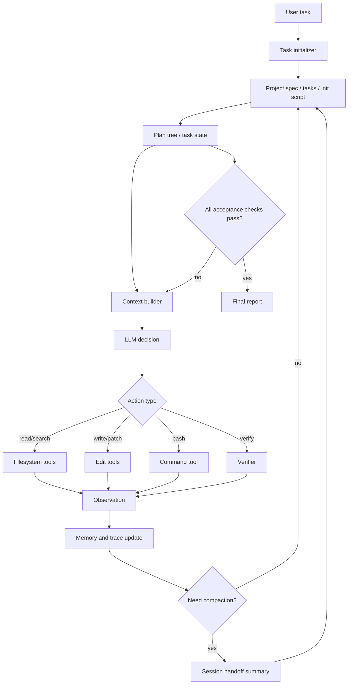

# Problem 3 Agent Framework Design

## 1. Goal

Build a minimal command-line coding agent that can run for long coding tasks without model training. The system focuses on the harness: task state, context handoff, verification, and filesystem-backed Skill/Memory.

The target is not to build the richest agent, but to make long-running behavior observable and measurable:

- keep explicit task progress instead of relying on chat history;
- survive context budget limits through compact handoff files;
- avoid premature completion through independent checks;
- persist reusable skills and task memory across sessions;
- produce run traces for experiments and ablations.

## 2. Core Idea

The framework is a state-machine around an LLM. The LLM proposes the next action, but the harness owns state transitions, context budget, tool execution, verification, and persistence.



## 3. Repository Layout

```text
long_running_agent/
  agent/
    main.py                 # CLI entrypoint
    loop.py                 # agent loop and state transitions
    llm.py                  # model provider abstraction
    context.py              # context packing and compaction
    planner.py              # plan tree update rules
    verifier.py             # independent completion checks
    tools/
      bash.py
      read.py
      write.py
      search.py
  state/
    current_task.json       # machine-readable task state
    memory.md               # durable facts and decisions
    handoff.md              # compact cross-session summary
    skills/
      coding.md             # reusable coding workflow skill
      debugging.md
      testing.md
    traces/
      run_001.jsonl         # action, observation, state snapshots
  eval/
    tasks/
    baselines/
    metrics.py
  docs/
    method.md
    experiments.md
```

## 4. Agent Loop

Each iteration follows a strict protocol:

1. Load task state, memory, relevant skills, and recent trace.
2. Build a bounded context packet.
3. Ask the model for exactly one next action.
4. Validate the action schema before execution.
5. Execute the tool.
6. Record observation and update task state.
7. Run verifier when a subtask or full task is claimed complete.
8. Compact or hand off context when token budget is high.

The model is not allowed to silently mark work as done. Completion is a harness-level transition that requires verifier evidence.

The Main Agent works on one active task per loop. It should not mix unrelated tasks in a single action. For coding tasks, the first code-writing action must be preceded by an acceptance contract agreed with the verifier.

## 4.1 Initializer / Planner

The Initializer runs once at project start and converts the vague request into durable artifacts:

- `project_spec.md`: project target, constraints, roles, and global completion criteria.
- `tasks.json`: task ids, dependencies, priority, status, and acceptance criteria.
- `init.sh`: repeatable setup and validation command.
- initial Git commit: stable baseline for future experiments.

After initialization, the Planner should only update the plan when task state is stale, too coarse, blocked, or contradicted by trace evidence.

## 4.2 Acceptance Contract

Before the Main Agent writes code for a task, it must propose a contract that the verifier can check independently:

```json
{
  "task_id": "T5",
  "summary": "Enforce acceptance contracts before coding",
  "scope": ["agent/loop.py", "agent/planner.py", "tests/"],
  "checks": [
    "write is rejected when no contract exists",
    "contract action records task id, scope, checks, and required evidence",
    "unit tests pass"
  ],
  "required_evidence": ["test output", "trace event"],
  "forbidden_shortcuts": ["Do not accept file existence as the only verification"]
}
```

The verifier should reject contracts that merely verify the Main Agent's chosen implementation rather than the user-visible behavior.

## 5. Action Schema

The LLM outputs JSON-like actions:

```json
{
  "thought_summary": "Short private-to-state reasoning summary.",
  "action": "answer | bash | contract | read | write | search | update_plan | verify | finish",
  "target": "file path, command, query, or task id",
  "args": {},
  "expected_observation": "What should be learned or changed.",
  "risk": "low | medium | high"
}
```

The harness rejects invalid actions, unsafe writes, unclear commands, or `finish` without passing acceptance checks.

## 6. Task State Management

The framework stores task progress as a plan tree:

```json
{
  "task_id": "run_001",
  "user_goal": "...",
  "acceptance_criteria": [
    "Code runs",
    "Tests pass",
    "Documentation explains usage"
  ],
  "nodes": [
    {
      "id": "T1",
      "title": "Inspect repository",
      "status": "done",
      "evidence": ["trace:12", "files:list"]
    },
    {
      "id": "T2",
      "title": "Implement feature",
      "status": "in_progress",
      "evidence": []
    }
  ],
  "blocked": [],
  "open_questions": [],
  "last_verified_at": null
}
```

Planning granularity should be medium-sized: one node should be checkable in 5-20 minutes. Too fine creates bookkeeping noise; too coarse makes handoff unreliable.

The next step is selected by:

- unfinished dependency-free node first;
- repair failed verifier node before new feature work;
- prefer tasks with concrete acceptance checks;
- when blocked, collect missing evidence rather than guessing.

## 7. Context Management

Context is rebuilt every iteration instead of appending raw history forever.

The context packet contains:

- system contract and action schema;
- user goal and acceptance criteria;
- current plan tree summary;
- recent N observations;
- relevant file snippets;
- selected memories;
- selected skills;
- current verifier status.

When context grows too large, the harness creates `state/handoff.md`:

```text
# Handoff

## Goal
...

## Confirmed Facts
...

## Current State
...

## Files Changed
...

## Failed Attempts
...

## Next Recommended Step
...

## Verification Status
...
```

Information that must cross context boundaries:

- user goal and non-negotiable constraints;
- acceptance criteria;
- current plan status;
- files changed and why;
- commands run and results;
- failed attempts and known traps;
- verification evidence;
- open risks.

Raw logs are not passed to the model unless needed; they remain in trace files.

## 8. Self-Verification

Verification is layered:

1. Static checks: syntax check, formatter check, lint if available.
2. Unit/integration tests: repository-native test command.
3. Behavioral smoke test: run the CLI/app on a minimal example.
4. State consistency check: every completed plan node must have evidence.
5. LLM critique: optional, but cannot be the only verifier.

The key design choice is that generation and verification use different evidence paths. The model can suggest "I think it is done", but the harness only accepts completion when independent checks pass or when failures are explicitly documented.

## 9. Skill Mechanism

Skills are reusable procedural knowledge saved as Markdown files. They are retrieved by keyword and task type.

Example skill file:

```text
# Python CLI Skill

Use when building a Python command-line tool.

Checklist:
- define argparse entrypoint;
- isolate side effects behind functions;
- add a smoke command;
- run python -m py_compile;
- document environment variables.

Common failure modes:
- import path breaks when launched from another cwd;
- tests pass but CLI entrypoint is missing.
```

Write to Skill only when:

- the rule is reusable across tasks;
- it was validated by a successful run;
- it is not just a temporary fact about this repository.

## 10. Memory Mechanism

Memory stores durable facts about the current task or project:

- project architecture decisions;
- accepted constraints;
- test commands and environment details;
- facts confirmed by tools;
- unresolved risks.

Memory should not store:

- full command logs;
- unverified assumptions;
- duplicate summaries;
- stale TODOs that already moved into the plan tree.

To reduce memory pollution, each memory entry has source evidence and status:

```text
- [confirmed][trace:42] The project uses pytest through `python -m pytest`.
- [decision][trace:51] Use JSONL traces because they are append-only and easy to analyze.
- [risk][trace:73] Network-dependent tests are flaky in the current environment.
```

## 11. Minimal Tools

The initial implementation only needs:

- `bash(command, timeout)`: run shell commands.
- `read(path, start, end)`: read bounded file content.
- `search(pattern, path)`: search files using ripgrep or fallback.
- `write(path, patch)`: apply controlled file edits.
- `verify(profile)`: run configured checks.

Tool outputs must be summarized and saved to trace. Large outputs are truncated in context but stored on disk.

## 12. Baselines and Ablations

Recommended baseline:

- Single-session ReAct agent with raw chat history, no persistent state, no handoff, no verifier gate.

Main system:

- plan tree + context builder + handoff + verifier + Skill/Memory.

Ablations:

- no context handoff;
- no verifier gate;
- no Skill/Memory retrieval;
- no explicit plan tree.

Metrics:

- autonomous runtime minutes;
- number of tool calls;
- number of context compactions or handoffs;
- percentage of acceptance criteria satisfied;
- number of repeated actions;
- number of premature finish attempts;
- final test pass rate;
- human interventions.

## 13. Evaluation Task

Use a repository task that exceeds a single context window. A practical option:

Build a small issue-tracker web app from an empty repo:

- backend CRUD API;
- frontend issue board;
- persistence with SQLite or JSON file;
- tests for API and core state transitions;
- README with run instructions;
- one scripted smoke test.

Acceptance criteria:

- install command works;
- app starts from CLI;
- create/list/update/delete issue works;
- tests pass;
- README documents usage;
- trace shows at least one handoff or compaction.

## 14. Expected Failure Modes

- Repeating completed work: plan state is too vague or evidence is missing.
- Premature finish: verifier is too weak or finish action bypassed checks.
- Context drift: handoff omitted failed attempts or changed files.
- Memory pollution: unverified assumptions were promoted to memory.
- Tool overuse: model asks for broad reads instead of targeted search.

These failures are useful experimental observations if the trace can attribute them to specific mechanism choices.

## 15. Implementation Milestones

1. Implement CLI and state files.
2. Implement minimal tools and trace logging.
3. Implement LLM action loop with schema validation.
4. Implement plan tree updates.
5. Implement context packing and handoff.
6. Implement verifier profiles.
7. Add Skill/Memory retrieval.
8. Run baseline and ablation experiments.
9. Write method and experiment report.
